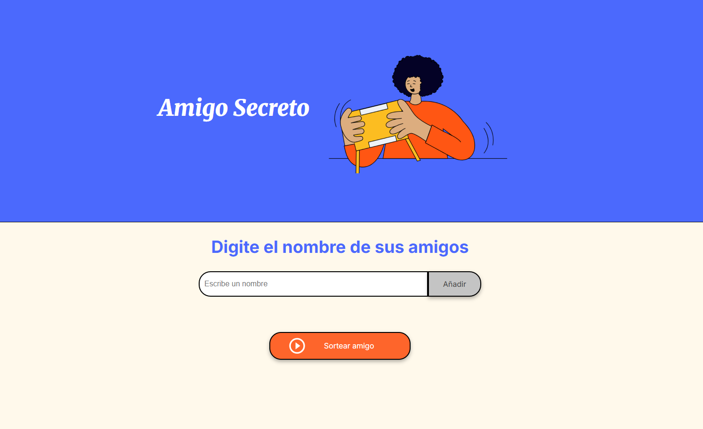

# Challenge Alura LATAM + Oracle Next Education

Proyecto Amigo Secreto 

Este proyecto es una aplicación web sencilla que permite a los usuarios agregar nombres de amigos y sortear un "amigo secreto" al azar.

Tecnologías Utilizadas

HTML5: Para la estructura básica del contenido web.
CSS3: Para el diseño y la disposición visual.
JavaScript: Para la lógica interactiva de la aplicación.
Estructura del Proyecto
index.html: Contiene la estructura HTML de la aplicación.
style.css: Define los estilos y el diseño visual de la aplicación.
app.js: Contiene la lógica de JavaScript para manejar la funcionalidad de agregar amigos y sortear un amigo secreto.

 Funcionalidades

 Agregar Amigos: Permite al usuario ingresar nombres en un campo de texto y agregarlos a una lista.

 Actualizar Lista: Muestra la lista actual de amigos ingresados.
Sortear Amigo Secreto: Selecciona un nombre al azar de la lista de amigos.

 Cómo Ejecutar el Proyecto

 Clona el repositorio en tu máquina local.

 Abre el archivo index.html en un navegador web.

 Ingresa los nombres de amigos y usa el botón "Añadir" para agregarlos a la lista.
 Haz clic en "Sortear amigo" para elegir un amigo secreto al azar.

